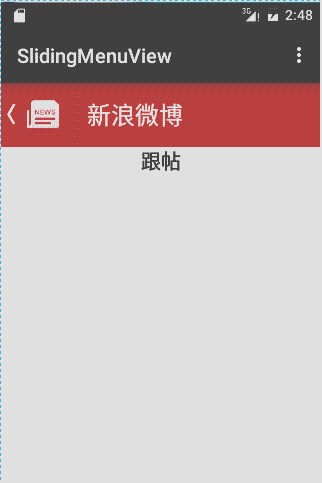

# SlidingMenuView
侧拉菜单

#####动画描述：

1.布局文件中使用
  
 	 <com.example.slidingmenuview.SplideView
        android:id="@+id/sv_slide"
        android:layout_width="fill_parent"
        android:layout_height="fill_parent">

        <!--主页内容-->
        <include layout="@layout/main_content"/>
        <!--侧拉页面-->
        <include layout="@layout/slide_item"/>

    </com.example.slidingmenuview.SplideView>
    
    2，定义主页和侧拉菜单布局
    
    3.实现主页中点击menu菜单打开和关闭侧拉菜单
    
      public void menu(View v){
       splideView.setToggle();
      }
   4.实现点击侧拉菜单中条目的点击事件
   
    public void click(View v){

        //文本的点击事件  点击的是哪一个条目 v就是哪一个
        TextView textView = (TextView) v;
        tv_content.setText(textView.getText());
        splideView.setToggle();
    }
    
####It'there you can do what you want to do .
   
    
     
